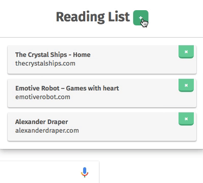

# Reading List
A Chrome extension for saving pages to read later. Free on the [Chrome Web Store](https://chrome.google.com/webstore/detail/lloccabjgblebdmncjndmiibianflabo).

The latest version features nifty animations!

## Putting it to use

### Installation

Get it from the [Chrome Web Store](https://chrome.google.com/webstore/detail/lloccabjgblebdmncjndmiibianflabo) for free.

Or, if you would rather do it the hard way:

  1. Download this repo
  2. Go to [chrome://extensions/](chrome://extensions/)
  3. Check “Developer Mode”
  4. Click “Load unpacked extension…”
  5. Load it up

### Actually using the extension

  1. Go to a page you want to save for later
  2. Click the reading list icon on the top right of your browser 
  3. Click the `+` button
    - You can also right-click anywhere on the page and select “Add page to Reading List”
  4. When you want to read a page you saved, open up the extension and click the reading item you want to read
    - `Control + click` or `command ⌘/windows key ⊞ + click` to open the page in a new tab
  5. Done with a page? Click the `×` next to said page in your reading list, and it will magically vanish.

## Todo

  - <del>Refactor way pages are stored—store the reading list array, instead of each page as its own storage object</del>
    - Turns out the whole list as an array can result in going over the storage limits for a single item and delete the whole list
  - Save favicons and display them in the reading list
  - Add a check to see if the user’s browser allows CSS animations, and provide backups if it does not
  - Add a directory structure to organize reading list items (maybe)
